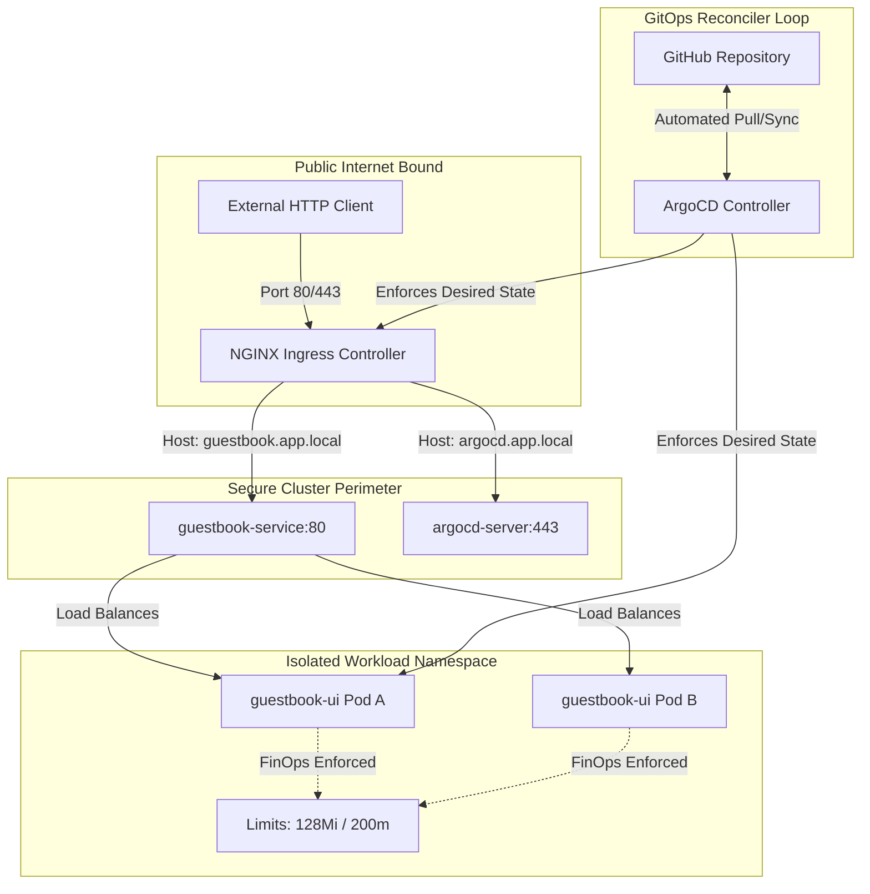

# Cloud-Native Perimeter GitOps Reference Architecture

An enterprise-grade, zero-cost (£0) cloud-native infrastructure sandbox implementing a secure network boundary and declarative GitOps pipelines. This repository demonstrates the isolation of administrative control planes from public application workloads utilizing a strict **DevSecOps Shift-Left** framework.

## 🏗️ Architecture Blueprint

The cluster perimeter handles Layer 7 host-based routing via an NGINX Ingress Controller. It ensures the internal cluster topology, core APIs, and management planes remain hidden from raw internet traffic while securely orchestrating container resources.



## 🛠️ Core Technology Stack
* **Orchestration Platform:** Kubernetes (Local Hypervisor via Minikube/Kind)
* **Continuous Delivery Engine:** ArgoCD (App-of-Apps Bootstrap Pattern)
* **Package Management:** Helm v2 Core API Specification
* **Edge Ingress Gateway:** NGINX Ingress Controller (L7 Host Routing)

---

## 📂 Repository File Structure
```text
cloud-native-perimeter/
├── root-application.yaml     # ArgoCD Bootstrap Orchestration Brain
├── apps/
│   └── guestbook/            # Micro-Helm Application Chart Directory
│       ├── Chart.yaml        # Enterprise Chart Metadata Block
│       ├── values.yaml       # Parameterized Flat Configuration Keys
│       └── templates/
│           ├── deployment.yaml # Hardened Container Pod Spec Matrix
│           ├── service.yaml    # Internal ClusterIP Discovery Layer
│           └── ingress.yaml    # Application L7 Edge Router Mapping
└── perimeter/
    └── manifests/
        └── argocd-ingress.yaml # Administrative Control Ingress Rules
```

---

## 🛡️ Key Cloud-Engineering Paradigms Demonstrated

### 1. Hardened DevSecOps Separation of Concerns
Infrastructure network controls (`perimeter/manifests`) are structurally completely decoupled from application development templates (`apps/guestbook`). This pattern models the principle of least privilege, preventing product code rollouts from accidentally mutating perimeter routing structures.

### 2. FinOps & Resource Isolation (Compute Bounds)
To maximize node density and simulate strict production runtime environments, the application containers are injected with strict computing boundaries:
* **Memory Constraints:** Request: `64Mi` | Maximum Limit: `128Mi`
* **CPU Constraints:** Request: `100m` | Maximum Limit: `200m`

### 3. Stateless GitOps Self-Healing Loop
ArgoCD drives continuous reconciliation between this GitHub source of truth and the running cluster state. Any ad-hoc changes manually executed in the cluster (`configuration drift`) are automatically intercepted, blocked, and overwritten by the active automated sync policy.

---

## 💻 Local Testing & Verification Workflow

### 1. Local Domain Bridge Configuration
Map the hostnames locally on your macOS system by editing your `/etc/hosts` file:
```bash
sudo echo "127.0.0.1 guestbook.app.local argocd.app.local" >> /etc/hosts
```

### 2. Helm Manifest Rendering Test
Verify the syntax of the parameters and configuration paths locally before pushing upstream code changes:
```bash
helm template apps/guestbook
```

### 3. Edge Perimeter Verification Tunnel
To stream and test external host-header routing rules over a local environment, tunnel directly into the ingress proxy layer:
```bash
kubectl port-forward deployment/ingress-nginx-controller -n ingress-nginx 8080:80
```

Execute a header-spoofed query from a separate shell window to pull the network payload:
```bash
curl -H "Host: guestbook.app.local" http://localhost:8080
```
